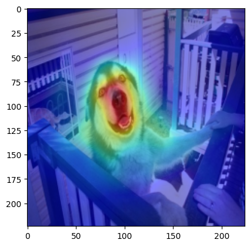
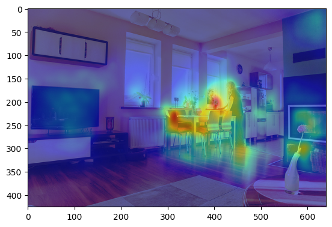
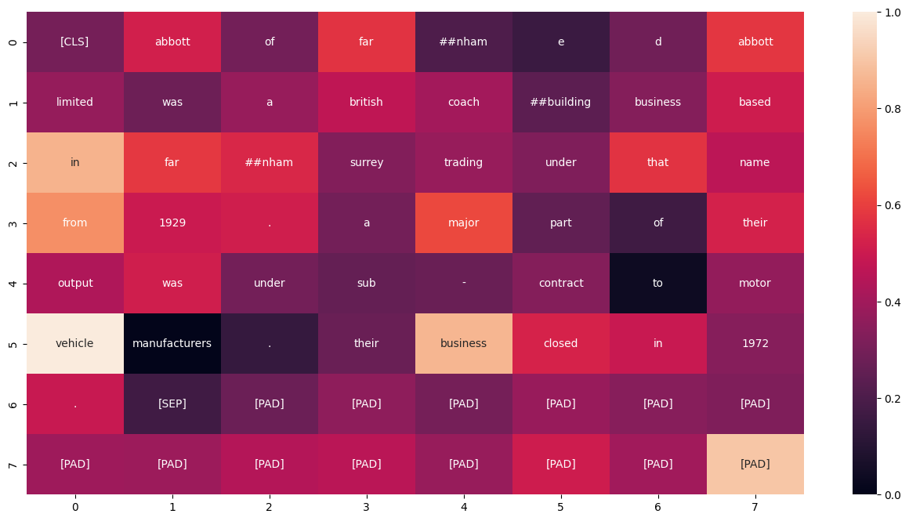
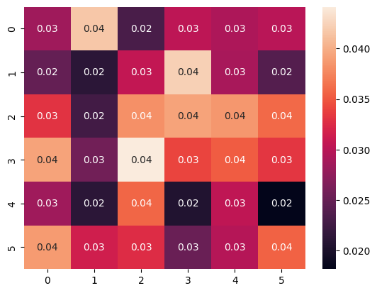

# ABE-XAI

This repository demonstrates adversarial attacks and explanation techniques using a provided model. It includes examples of both untargeted and targeted adversarial attacks, together with several visualisation utilities that help interpret a model’s behaviour across **image**, **object‑detection**, **natural‑language** and **time‑series** tasks.

---

## Requirements

* **Python 3.8+**
* **PyTorch** & **torchvision**
* **Pillow (PIL)**
* Other custom modules in this repo (`abe.algorithm`, `abe.task`, `abe.metric.visualization`, …)

---

## Setup

1. **Model definition** – by default we use a pre‑trained ResNet‑50 for image classification, but the same pipeline can be extended to other domains.

   ```python
   model = nn.Sequential(
       Normalize(mean=[0.485, 0.456, 0.406], std=[0.229, 0.224, 0.225]),
       resnet50(pretrained=True)
   ).eval().cuda()
   ```
2. **Loss function** – for classification we typically use cross‑entropy:

   ```python
   def loss_fn(batch):
       x, y = batch
       logits = model(x)
       return F.cross_entropy(logits, y)
   ```

---

## Adversarial attack workflow

1. **Define the task**

   ```python
   task = AttackTask(loss_fn=loss_fn, model_type=ModelType.IMAGECLASSIFICATION,
                     is_targeted=False)
   ```
2. **Choose an algorithm** – e.g. BIM, FGSM, PGD, CW, MI‑FGSM:

   ```python
   attack = BIM(task)
   adversarial_x = attack([sample_x, sample_y])
   ```
3. **Visualise the result**

   ```python
   plot_adversarial_sample(forward, batch=[sample_x, sample_y],
                           adversarial_sample=adversarial_x,
                           model_type=ModelType.IMAGECLASSIFICATION)
   ```

---

## Explanation workflow

1. **Define an explanation task**

   ```python
   def loss_fn(batch):
       x, y = batch
       logits = model(x)
       loss = -torch.diag(logits[:, y]).sum()
       return loss
   ```
2. **Pick an algorithm** – e.g. AMPE, IG, Saliency Map:

   ```python
   explanation = AMPE(explanation_task)
   attribution  = explanation([sample_x, sample_y])
   ```
3. **Render a heat‑map**

   ```python
   plot_explanation_heatmap(attribution, sample_x)
   ```

---

## Sample visualisations

The thumbnails below are **not** committed binary files. They are generated automatically when you run the accompanying Colab notebooks (links in the next section).  Each notebook saves its figure to the folder `colab_outputs/` with a fixed file‑name, and this README simply renders those images once they exist locally or in your fork.  Therefore, to refresh the visuals just re‑run the notebook, commit the new `*.png`, and the table will update itself.

| Task                                | Sample (auto‑generated)                                             | What the heat‑map tells us                                                                                                                                                                 |
| ----------------------------------- | ------------------------------------------------------------------- | ------------------------------------------------------------------------------------------------------------------------------------------------------------------------------------------ |
| **Image classification**            |              | Red/yellow regions indicate strong influence around the dog’s snout and torso, while background fencing is suppressed (blue).           |
| **Object detection**                |          | Faster R-CNN focuses on the person near the dining table and salient furniture (TV, vase), showing where high objectness scores arise.                                               |
| **Natural‑language classification** |         | Token‑level attributions from BERT highlight words such as “limited”, “trading” and “business” (lighter squares). These corporate cues dominate the model’s *company‑profile* decision.    |
| **Time‑series prediction**          |  | A multivariate LSTM forecaster: darker cells identify sensors and horizons that contribute most to the next‑step forecast, helping practitioners spot dominant signals and temporal drift. |

---

## Example notebooks

| Notebook                   | Colab                                                                                                                                                                               |
| -------------------------- | ----------------------------------------------------------------------------------------------------------------------------------------------------------------------------------- |
| **Time‑series prediction** | [](https://colab.research.google.com/github/LMBTough/ABE-XAI/blob/main/colab/time_series_predition.ipynb) |
| **Image classification**   | [](https://colab.research.google.com/github/LMBTough/ABE-XAI/blob/main/colab/image_classification.ipynb)  |
| **Object detection**       | [](https://colab.research.google.com/github/LMBTough/ABE-XAI/blob/main/colab/object_detection.ipynb)      |
| **Text classification**    | [](https://colab.research.google.com/github/LMBTough/ABE-XAI/blob/main/colab/nlp_classification.ipynb)    |

---

For questions or contributions please open an issue or contact the maintainers.
